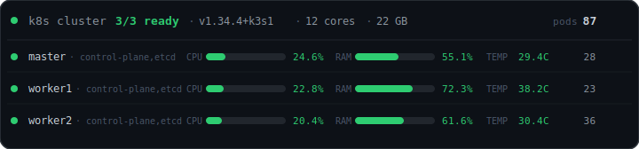

# k8s-badge


Lightweight Kubernetes cluster monitoring — live SVG badges and JSON API.


---
## Architecture

Two components deployed via Helm:

| Component | Kind | Description |
|---|---|---|
| `k8s-badge-agent` | DaemonSet | Runs on every node, reads `/proc` and `/sys` — cpu%, ram%, temperature, load, uptime |
| `k8s-badge-api` | Deployment ×1 | Merges agent data with k8s API + metrics-server, renders SVG and JSON |

The API discovers agents dynamically — lists DaemonSet pods by label and calls each pod IP. No static addresses needed.

---

## Endpoints

| Endpoint | Description |
|---|---|
| `GET /metrics` | Full cluster JSON |
| `GET /metrics/{node}` | Single-node JSON |
| `GET /badge.svg` | SVG badge — all nodes (720px wide) |
| `GET /badge/{node}.svg` | SVG badge — single node (640px wide) |


---

## Customisation

All visual constants are at the top of `api/app/svg.py`:

```python
# Colours
BG        = "#0d1117"   # badge background
BORDER    = "#30363d"   # border

# Thresholds (green → yellow → red)
WARN_CPU  = 70    CRIT_CPU  = 85
WARN_RAM  = 75    CRIT_RAM  = 90
WARN_TEMP = 55    CRIT_TEMP = 75   # °C

# Dimensions (cluster badge)
W      = 720    # total width
BAR_W  = 90     # progress bar width
ROW_H  = 36     # height per node row
```

---

## Deployment

```bash
# 1. tag → GitHub Actions builds images + chart
git tag v0.1.0 && git push origin v0.1.0

# 2. add to k3s-homelab/apps/base/kustomization.yaml:
#    - k8s-badge
git add apps/base/ && git commit -m "feat(flux): add k8s-badge" && git push

# 3. watch
flux get helmreleases -n monitoring --watch
kubectl get pods -n monitoring -l app.kubernetes.io/name=k8s-badge
```

Requires metrics-server (`kubectl top nodes` must work).

## License

MIT